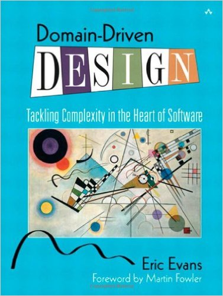
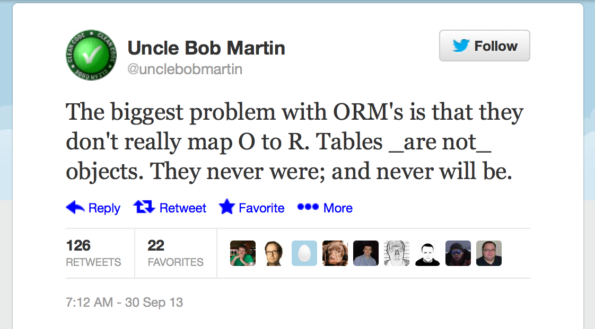
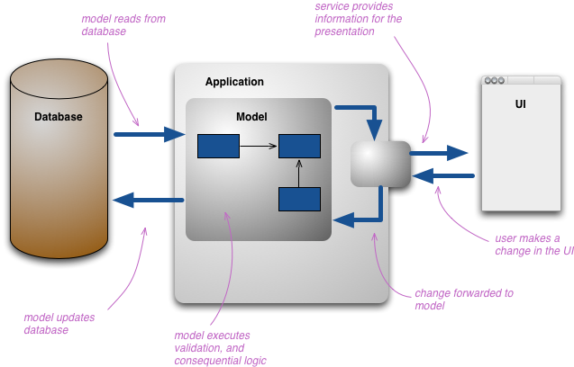
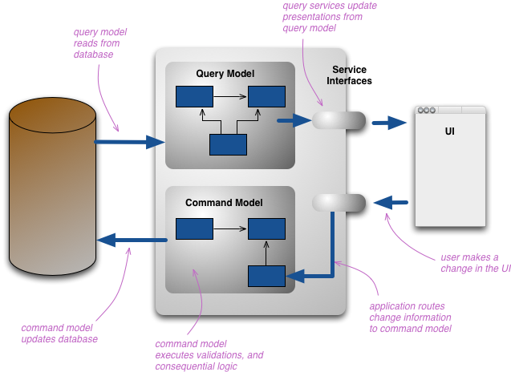
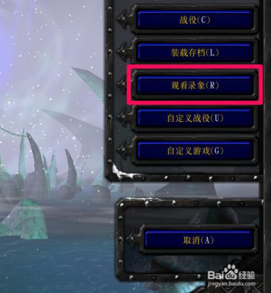
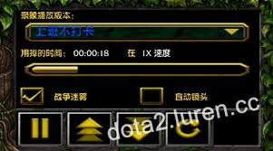
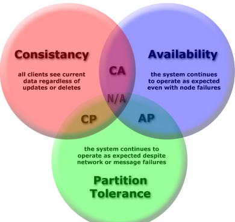
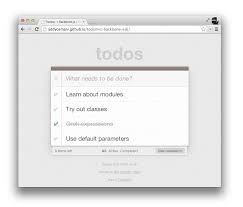
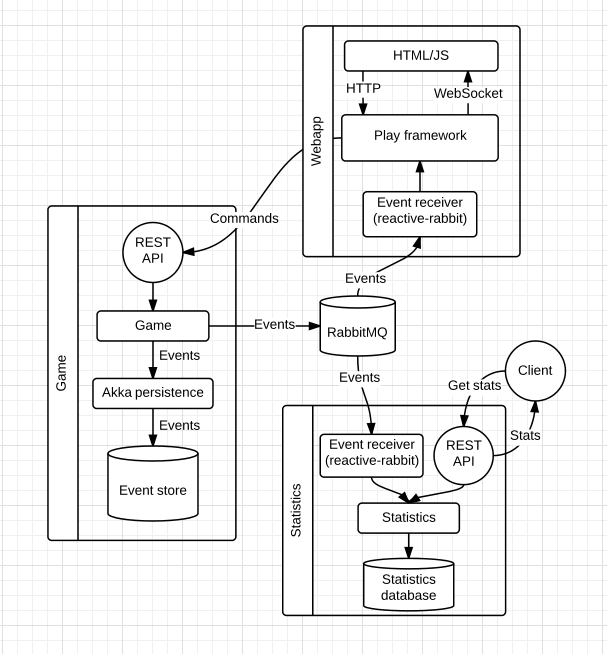

# Beyond Rails (理论篇)

the next generation architecture for the new world

author: 马陆骋 <malucheng@boohee.com>


## 为什么做这次分享

- 拓宽视野，看到不一样的世界。

- 通过对比，加深现有技术的理解。


## 这次分享 _并不是_

- 对现有方案的否定

- 某种最佳实践的推广

## What is Rails？

full-stack web develop framework

- MVC
- RESTful

## How Rails Works？

约定大于配置 + 脚手架 = 快速开发

### About RESTful

> REST(Representational State Transfer 状态表述转移)是HTTP协议的作者Roy Fielding博士在其博士论文中提出的一种互联网应用构架风格。

> 在REST的世界中，资源即状态，而互联网就是一个巨大的状态机：每个网页是其一个状态；url是状态的表述；REST风格的应用则是从一个状态迁移到下一个状态的状态转移过程。

### About MVC


## Rails Components


https://github.com/rails/rails

### More Detail

- actioncable (skip)
- actionmailer （skip）
- actionpack （C of MVC）
- actionview  (V of MVC)
- activejob	  (skip)
- activemodel (M of MVC without database support)
- activerecord (M of MVC with database support)
- activesupport (skip)

## Rails - Model

几乎所有的 Rails 中的 model 都是 ActiveRecord 的子类

```ruby
class Firm < ActiveRecord::Base
  has_many   :clients
  has_one    :account
  belongs_to :conglomerate
end
```

### What is ActiveRecord？

> An object that wraps a row in a database table or view, encapsulates the database access, and adds domain logic on that data.

http://www.martinfowler.com/eaaCatalog/activeRecord.html

### Summary

Rails 中的 model

- 是数据库表的抽象
- 可以很方便的操作数据库中对应的数据

## Rails - View

> Action View is a framework for handling view template lookup and rendering

https://github.com/rails/rails/blob/master/actionview%2FREADME.rdoc

> Template formats that Action View handles are ERB (embedded Ruby, typically used to inline short Ruby snippets inside HTML), and XML Builder.

It's just template, nothing more.

### Other frameworks view

https://github.com/hanami/view

separation between views and templates.

A view is an object that encapsulates the presentation logic of a page. A template is a file that defines the semantic and visual elements of a page. In order to show a result to a user, a template must be rendered by a view.

### Summary

view 在 Rails 中是非常薄的一层。

## Rails - Controller

From request to response

### What a controller in Rails do?

- handle params
- invoke business logic
- render view

### Summary

除了 strong parameters 部分职责不明确

是一个很尽责的调度者

## That's Rails


## 暂时忘记上面说的

介绍一些新的术语

## DDD

Domain Driven Design



### Difference from ActiveRecord

这是一个关公战秦琼的话题. 两者并不在一个层面上.

在表达一个复杂的 model 时:

- DDD 强调聚合根的使用(数据库无关)
- ActiveRecord 注重不同表的关系的组成(数据库强耦合)

### 数据库无关的好处


[Ditch Your Orm](http://solnic.eu/2015/09/18/ditch-your-orm.html)

## CQRS

Command Query Responsibility Seperation

### Command Query Separation

> Command–query separation (CQS) is a principle of imperative computer programming. It was devised by Bertrand Meyer as part of his pioneering work on the Eiffel programming language.

> It states that every method should either be a command that performs an action, or a query that returns data to the caller, but not both

https://en.wikipedia.org/wiki/Command%E2%80%93query_separation

### 代码层面(读写不分离)

```java
private int x;
public int increment_and_return_x()
{
  lock x;   // by some mechanism
  x = x + 1;
  int x_copy = x;
  unlock x; // by some mechanism
  return x_copy;
}
```

### 代码层面(读写分离)

```java
private int x;
public int value()
{
  return x;
}
void increment()
{
  x = x + 1;
}
```

### 架构层面(读写不分离)



### 架构层面(读写分离)



## Event Sourcing

Use an append-only store to record the full series of events that describe actions taken on data in a domain, rather than storing just the current state, so that the store can be used to materialize the domain objects.

### Write Model

receive Commands and produce Events

### Read Models

created from events

## How it works

Command => Write Model => Event

Event => [View1, View2 ...]

### Example

用户发布了一个动态, 服务端接收了一个用户想要发送动态的 command

Post 域模型接收这个 command 并产生一个 Event

然后 Event 的订阅者接收到 Event 后, 更新相应的 view:

- Event => AdminPostView (maybe mysql)

- Event => UserPostView (maybe nosql)

### Difference between command and event

+ command - 表意图, 将来时, *可能有副作用*
+ event   - 表事实, 过去式, 已经发生, *没有副作用*

### What about the view?

In Rails, view is just template.
W
When it comes to CRQS, view is something like database schema.

## 工作原理



### Difference View



## Main Differences

### ActiveRecord VS Event Sourcing

- ActiveRecord 保存当前的 model 的状态
- Event Sourcing 保存的是 model 经历过的事件

### Rails VS DDD

Rails(RESTful MVC)

- 数据库是系统的唯一的状态储存
- 只能表达系统的*当前状态*

DDD(Event Sourcing with CQRS)

- 储存了系统生命周期中的所有事件
- 数据库仅仅是系统*当前状态的快照*

### eventually consistent

CAP Theorem

- 一致性(Consistency)
- 可用性(Availability)
- 分区容忍性(Partition tolerance)



### Availability & Partition tolernace

在分布式的场景，分布式事务的难度、成本是非常高的

很多时候，我们也会放弃数据的强一致性，而采用最终一致性；从CAP定理的角度来说，就是放弃一致性，选择可用性。

## Advange

- 松耦合, 扩展性强(事件驱动)
- 容易跟踪和调试(growth hacker)
- Database schema free

## Disadvange

- 入门困难
- 框架成熟度不够
- 对客户端有一定要求
- 基础设施的要求也更高

## Demo TODO MVC(伪)

一个 TODO 应用



### 传统的 Rails 版本

user send request, server receive request

and change activerecord model state (database record)

and return response

### What you get?

| id  | content   | finished  | created_at           | updated_at  |
|-----|-----------|-----------|----------------------|-------------|
| 1   | buy milk  | true      | 2016-04-01 12:12:12  | 2016-04-01 12:22:12  |


### CQRS with Event Sourcing

user send request, server dispatch command to domain,

domain receive command and change its state and return event.

server save event and then view updated.

### What you get?

| id  | content   | finished  | created_at           | updated_at  |
|-----|-----------|-----------|----------------------|-------------|
| 1   | buy milk  | true      | 2016-04-01 12:12:12  | 2016-04-01 12:22:12  |

### And

```json
{
  command: "item_created",
  content: "buy milk",
  created_at: '2016-04-01 12:12:12'
},
{
  command: "item_finished",
  id: 1,
  created_at: '2016-04-01 12:22:12'
},
```


### 如果要增加一个需求

积分系统需求:

1. 新建一个 todo item 加 1 分.
2. 完成一个 todo item 加 5 分.
3. 删除一个 todo item 减 3 分.

### 传统的 Rails 应用

对历史数据无能为力, 对升级后的系统, 只能在相应的 action 或者 callback 中插入积分逻辑代码


### CRQS with Event Sourcing

由于储存了所有的事件, 只需要新加一个模块用于积分统计:

```ruby
events = [
  {command: "item_created", content: "buy milk"},
  {command: "item_finished", id: 1},
  {command: "item_deleted", id: 1}
]

TodoReport.apply(events) # => update view
```

### Apply Event Souring and generate the view

```ruby
score = 1 + 5 - 3 # => 3
```

## Another Demo

https://github.com/LukasGasior1/event-sourced-dice-game



## Thanks and Question

更深入的技术细节与代码请看下回分解

剧透:

- scala (playframework)
- akka (actor)
- reactive
