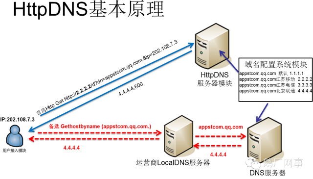

# 关于我

stormzhang，热爱分享，拥抱开源的一位 AndroidDeveloper（段子手） ，
现在担任薄荷科技技术负责人（全栈打杂）。

## 目录

- 背景
- 现象
- 运营商的罪状
- 什么是RESTFul
- 如何解决RESTFul API的限制
- 什么是运营商劫持？
- 运营商劫持的手段
- 如何解决运营商劫持？
- Http DNS
- Http DNS的优势
- 实践中遇到的困难
- 取得的成效
- 未来的展望
- Q&A

## 背景

在利益的驱动下，天朝什么事都能发生，比如网络问题，国内跟国外的环境完全两样！

## 现象（以App为例）

- 用户反映App内购物车删除不了；

- App内的网页打开之后莫名的出现了广告；

- 用户干脆连我们App都访问不了；

### 一个字

### 真他妈的冤！

## 逐个击破

### 用户反映App内购物车删除不了；

### 某些偏远运营商不支持Delete方法。

### App内的网页打开之后莫名的出现了广告；

### 内容劫持

### 用户干脆连我们App都访问不了；

### DNS（域名）劫持

## 运营商的罪状

- RESTFul API的限制

- 运营商劫持问题

## 什么是RESTFul？

一种软件架构风格，注意是一种风格，而不是标准。

简单点说RESTFul API最主要一点是：就是HTTP协议里面，四个表示操作方式的动词：GET、POST、PUT、DELETE。它们分别对应四种基本操作：GET用来获取资源，POST用来新建资源（也可以用于更新资源），PUT用来更新资源，DELETE用来删除资源。

## 如何解决RESTFul API的限制

只用GET、POST方法，尽量避免使用DELETE、PUT等Http方法；

## 什么是运营商劫持？

我们在访问一个网站，是要先经过运营商，然后再中转到网站的服务器。而运营商在中间为了谋取利益，在中间恶意注入广告、域名恶意解析失败跳转到错误页面等的行为就是运营商劫持，一般运营商劫持多指Http协议，包括内容劫持和DNS劫持两部分。

## 运营商劫持的手段

- 在访问的网站页面追加广告代码，多在一些网站以及手机App里的HTML页面常见，即内容劫持。

- 恶意解析失败，即DNS劫持，一些运营商恶意分析请求的域名，返回一些错误的IP，跳转到指定广告页面或者无反应。

## 如何解决运营商劫持？

### 绕过自动分配DNS，使用114dns或Google public DNS

这个方案看上去很美好，114dns是国内最大的中立缓存DNS，而Google又是秉承不作恶理念的互联网工程帝国巨鳄。但是问题来了：对于PC端的来说，更改DNS配置不难，但是在手机端，要兼容Android和iOS两个平台，很困难，而且让用户自己修改相关配置更是难上加难。

### 使用Https？

Https只能解决内容劫持，却无法解决DNS劫持问题！

## Http DNS

HttpDNS最早是腾讯提出的，是为移动客户端量身定做的基于Http协议和域名解析的流量调度解决方案

### HttpDNS基本原理

### HttpDNS的原理非常简单，主要有两步：

- A、客户端直接访问HttpDNS接口，获取在域名配置管理系统上配置的最优的IP。

- B、客户端获取到IP后直接往此IP发送请求。以Http请求为例，通过在header中指定host字段，向HttpDNS返回的IP发送标准的Http请求即可。

## Http DNS的优势

- 根治域名解析异常

- 实现成本低廉

- 调度精准

## 实践中遇到的困难

### 通过HttpDNS获取IP的频率要控制好

我们的方案：本地缓存IP地址，24小时内单个域名的IP获取会更新一次

### 获取IP后遇到过使用IP访问api依然无法访问的情况，所以应该有部分运营商屏蔽了IP直连！！！

我们的方案：默认仍然使用域名访问，在检测使用IP请求ok之后下一次的访问才会使用IP

### 使用IP之后第一次ok，但是中途依然会出现访问失败的情况

我们的方案：使用域名或者IP访问失败之后，下次请求会自动切换通道，直到访问成功为止

## 取得的成效

网络问题没法根治，我们能做的是只能尽量减少访问失败的比例，目前来看访问失败的比例大大减少！

## 未来的展望

多线路、多通道，访问失败之后智能切换！

## Q&A

Thanks!

